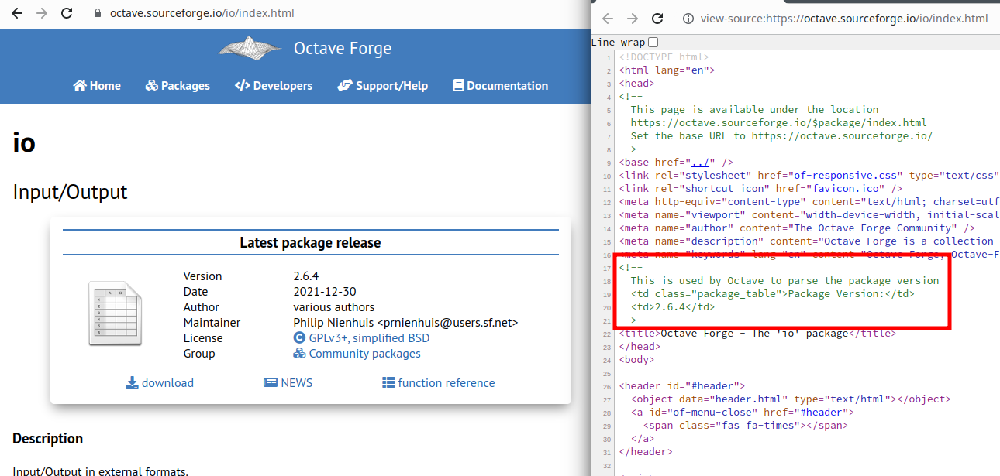

# MinusForge

A server side pkg resolver for Octave Packages.

## How does pkg install -forge work?

Since
[about the year 2010](https://hg.savannah.gnu.org/hgweb/octave/annotate/76aba4305f1f/scripts/pkg/get_forge_pkg.m)
one can install Octave packages from
[Octave Forge](https://octave.sourceforge.io)
via `pkg install -forge`.
This mechanism
[did not change](https://hg.savannah.gnu.org/hgweb/octave/annotate/670a0d878af1/scripts/pkg/private/get_forge_pkg.m)
ever since.

Under the hood,
the pkg command web scraps the latest package version from a fixed URL,
that is currently redirected to Octave Forge.

In the following example for the **io**-package:
```octave
## Redirected to https://octave.sourceforge.io/io/index.html
html = urlread ("https://packages.octave.org/io/index.html");
html(isspace (html)) = [];
pat = "<tdclass=""package_table"">PackageVersion:</td><td>([\\d.]*)</td>";
t = regexp (html, pat, "tokens");
```

During the Octave Forge redesign this pkg design decision required a workaround,
as can be seen in the following figure:

[](forge_io.png)

The problem is **compatibility** with older Octave versions.

In a second step the latest package version is retrieved from another fixed url:

> https://packages.octave.org/download/io-2.6.4.tar.gz

that redirects to the centralized Octave Forge download location

> https://downloads.sourceforge.net/octave/io-2.6.4.tar.gz?download


## How does pkg list -forge work?

A second less famous use case that might have to be covered by this project
is listing Octave Forge packages with their latest version.

From [bug #39479](https://savannah.gnu.org/bugs/?39479)
it can be conclude that this feature has not been widely embraced by users,
as listing those 71 packages with their latest version number could take
up to minutes.

Under the hood,
first <https://packages.octave.org/list_packages.php> is read to get a list
of all package names.
In old Octave pkg versions before 2019 (bug #39479),
the above mechanism is used to retrieve each package version,
while since Octave 6 another hacky solution web scrapes the SourceForge
download directory
<https://sourceforge.net/projects/octave/files/Octave%20Forge%20Packages/Individual%20Package%20Releases>
to extract the version numbers.


## About MinusForge

The idea of MinusForge is to build a small PHP based web service
deployed on octave.org that handles all three types of pkg queries

- https://packages.octave.org/io/index.html
- https://packages.octave.org/download/io-2.6.4.tar.gz
- https://packages.octave.org/list_packages.php

and replies in a way that even old Octave pkg versions can resolve
the whole Octave Packages repository.
